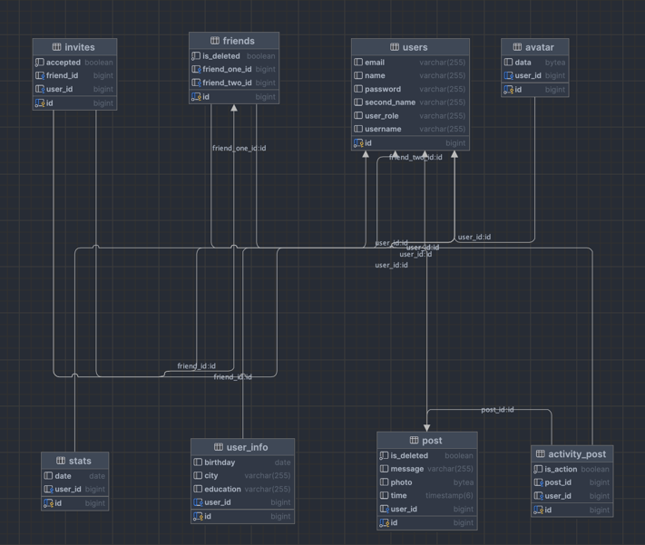
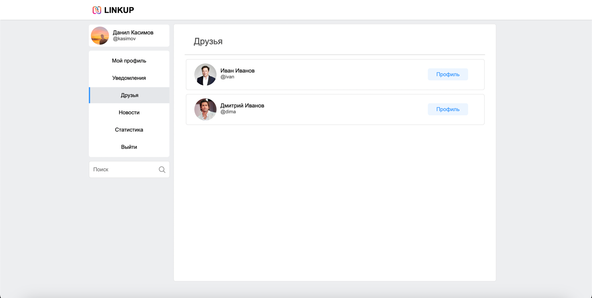
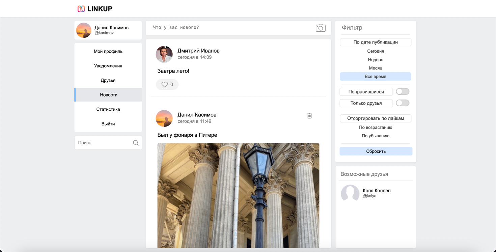

# Социальная сеть - Linkup

## Описание

    Проект представляет собой социальную сеть, где каждый пользователь может отправлять посты, лайкать, а также добавляться
    в друзья к другим пользователям

## Схема

 

Приложение представляет собой микросервис. В frontend используется фреймворк Vue.js. Backend представляет собой 
SpringBoot приложение, который общается с frontend с помощью REST API. Также присутствует небольшой сервер
на Python Flask, который принимает данные с основного сервера, производит некоторые вычисления, формирует 
json объект и отправляет его обратно на сервер, где этот объект будет передан во frontend для отображения данных
статистики пользователя. В качестве базы данных используется Postgresql

## Схема базы данных

## Функционал
### Вход и регистрация

### Различные проверки данных пользователя 

### Переход на профиль пользователя

### Возможность редактирования данных пользователя

### Отправка постов 

### Отметки "Нравится"

### Отправление запроса на добавление в друзья 

### Список друзей

### Новости (посты всех пользователей)

"Возможные друзья" - это список друзей, друзей пользователя

### Статистика

### Полнотекстовый поиск 

Используется "to_tsvector" для поиска пользователя по его имени аккаунта

### Администратор

В отличие от обычного пользователя, может удалять чужие посты

